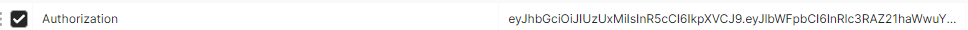

# coincap

to run this service:
1. go mod vendor
2. go run main.go

step to test:
1.  Create an account
    hit endpoint /v1/user/signup to create a new account, or you can use existing credential:
    username: nofla1234
    password: yoman
    to just automatically login

2.  Hit all available endpoints with Header Authorization Token like this 

list of available endpoints with prefix localhost:8080:
1. /ping -> health check
2. /user/login -> log in to get new token
3. /v1/user/signup -> create a new account
4. /v1/mycoin/stared -> show all stared (tracked) coin
5. /v1/mycoin/add -> add a coin to be stared
6. /v1/mycoin/delete -> delete a coin from stared
7. /v1/coin/list -> list of all available coins